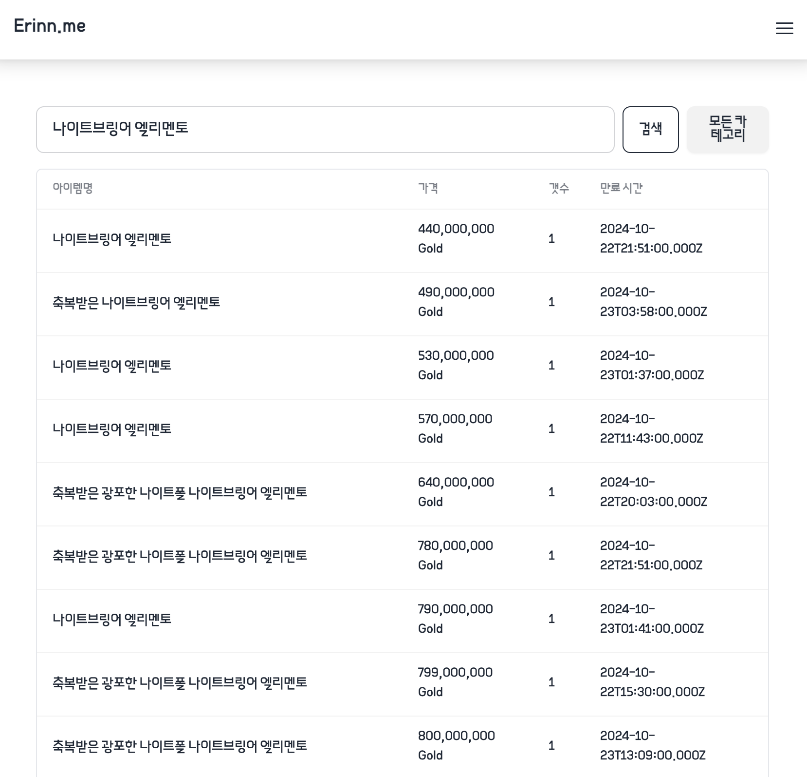

<div id="top"></div>


<!-- PROJECT LOGO -->
<br />
<div align="center">
  <a href="https://github.com/sweatpotato13/erinn.me"></a>

<h3 align="center">Erinn.me</h3>

  <p align="center">
    A project utilizing Mabinogi's OpenAPI to proview market, horn and more
    <br />
    <a href="https://erinn.me">View Demo</a>
    ·
    <a href="https://github.com/sweatpotato13/erinn.me/issues">Report Bug</a>
    ·
    <a href="https://github.com/sweatpotato13/erinn.me/issues">Request Feature</a>
  </p>
</div>


### Screenshots

<br>

<br>

### Built With

* [pnpm](https://pnpm.io)
* [Next.js](https://nextjs.org/)

<p align="right">(<a href="#top">back to top</a>)</p>


<!-- GETTING STARTED -->
## Getting Started

This is an example of how you may give instructions on setting up your project locally.
To get a local copy up and running follow these simple example steps.

### Installation

1. Clone the repo
   ```sh
   git clone https://github.com/sweatpotato13/erinn.me.git
   ```

2. Install dependencies
   ```sh
   pnpm install
   ```

3. write .env file
   ```sh
   cp .env.example .env
   nano .env
   ```

4. Start the development server
    ```sh
    pnpm dev
    ```

5. or build and start the production server
    ```sh
    pnpm build
    pnpm start
    ```

<p align="right">(<a href="#top">back to top</a>)</p>