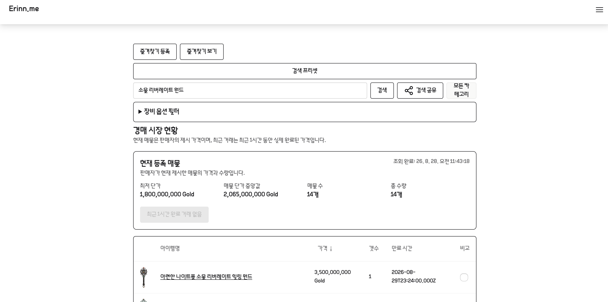

<div id="top"></div>


<!-- PROJECT LOGO -->
<br />
<div align="center">
  <a href="https://github.com/sweatpotato13/erinn.me"></a>

<h3 align="center">Erinn.me</h3>

  <p align="center">
    A project utilizing Mabinogi's OpenAPI to proview market, horn and more
    <br />
    <a href="https://erinn.me">View Demo</a>
    ·
    <a href="https://github.com/sweatpotato13/erinn.me/issues">Report Bug</a>
    ·
    <a href="https://github.com/sweatpotato13/erinn.me/issues">Request Feature</a>
  </p>
</div>


### Screenshots

<br>

<br>

### Built With

* [pnpm](https://pnpm.io)
* [Next.js](https://nextjs.org/)

<p align="right">(<a href="#top">back to top</a>)</p>


<!-- GETTING STARTED -->
## Getting Started

This is an example of how you may give instructions on setting up your project locally.
To get a local copy up and running follow these simple example steps.

### Installation

1. Clone the repo
   ```sh
   git clone https://github.com/sweatpotato13/erinn.me.git
   ```

2. Install dependencies
   ```sh
   pnpm install
   ```

3. write .env file
   ```sh
   cp .env.example .env
   nano .env
   ```

4. Start the development server
    ```sh
    pnpm dev
    ```

5. or build and start the production server
    ```sh
    pnpm build
    pnpm start
    ```

### Rate-limit deployment

The API proxy trusts only Vercel's `x-vercel-forwarded-for` header for client
identity and ignores `x-forwarded-for`. Any reverse proxy placed in front of
Vercel must strip client-supplied `x-vercel-forwarded-for` values before
forwarding requests.

Configure these programmatic rate-limit IDs in the Vercel Firewall dashboard:

| ID | Limit | Window |
| --- | ---: | ---: |
| `erinn-contact` | 3 | 60 seconds |
| `erinn-upstream` | 60 | 60 seconds |
| `erinn-image` | 120 | 60 seconds |
| `erinn-suggest` | 120 | 60 seconds |

Each rule must use the `@vercel/firewall` condition with its matching ID. A
missing rule or WAF check failure returns HTTP 503 instead of bypassing the
quota. Local development and Vercel Preview deployments bypass these checks;
Preview deployments must remain protected with Vercel Authentication. This
avoids requiring an Automation Bypass secret for the SDK's internal request,
while Production continues to fail closed.

To verify the Production WAF path before merging to `main`:

1. Enable **Automatically expose System Environment Variables** and
   **Protection Bypass for Automation** in the Vercel project settings.
2. Add `ENABLE_PREVIEW_RATE_LIMIT=true` to the Preview environment, scoped to
   the `develop` branch, and redeploy it.
3. Request a protected API route and confirm it returns HTTP 200 with an
   `X-RateLimit-Limit` header. HTTP 503 means the matching rate-limit ID or the
   Automation Bypass setup is still unavailable.
4. Remove `ENABLE_PREVIEW_RATE_LIMIT` after verification and redeploy
   `develop` to restore the default Preview bypass.

Never add `ENABLE_PREVIEW_RATE_LIMIT` to Production: Production always applies
the WAF regardless of this variable.

<p align="right">(<a href="#top">back to top</a>)</p>
